# Robo-Rover Distributed Architecture

## Overview

The robo-rover system uses a **distributed architecture** with two deployment targets:

- **Orchestra (Workstation)**: Heavy AI/ML processing, web interface, fleet control
- **Rover-Kiwi (Raspberry Pi 5)**: Hardware I/O, motor control, low-latency control loops

Communication between machines uses **Zenoh** (pub/sub protocol) for efficient real-time data exchange. Alternatively, the rover can run in **direct mode** (`ROVER_MODE=direct`) with `web_bridge` on the rover itself - no Zenoh or orchestra required.

## Architecture Diagram

```
┌─────────────────────────────────┐          ┌─────────────────────────────────┐
│   ORCHESTRA (Workstation)       │          │   ROVER-KIWI (Raspberry Pi 5)   │
│                                 │          │                                 │
│  ┌──────────────────┐           │          │  ┌──────────────────┐           │
│  │  Web UI (3000)   │           │          │  │  Hardware I/O    │           │
│  │  Socket.IO (3030)│           │          │  │  - Camera        │           │
│  └────────┬─────────┘           │          │  │  - Microphone    │           │
│           │                     │          │  │  - Motors        │           │
│  ┌────────▼─────────┐           │          │  │  - Servos        │           │
│  │   web-bridge     │           │          │  └────────┬─────────┘           │
│  └────────┬─────────┘           │          │           │                     │
│           │                     │          │  ┌────────▼─────────┐           │
│  ┌────────▼─────────┐           │          │  │  ML Inference    │           │
│  │  Heavy Compute   │           │   Zenoh  │  │  - YOLO Detect   │           │
│  │  - Central STT   │◄──────────┼──────────┤► │  - OSNet ReID    │           │
│  │  - Command NLU   │   P2P     │          │  │  - BoTSORT+CMC   │           │
│  │                  │           │          │  └────────┬─────────┘           │
│  └────────┬─────────┘           │          │           │                     │
│           │                     │          │  ┌────────▼─────────┐           │
│           │                     │          │  │ Controllers      │           │
│  ┌────────▼─────────┐           │          │  │ - rover          │           │
│  │  orchestra-      │           │          │  │ - arm            │           │
│  │  bridge          │           │          │  │ - visual servo   │           │
│  │  (orchestra mode)│           │          │  └────────┬─────────┘           │
│  └──────────────────┘           │          │           │                     │
│                                 │          │  ┌────────▼─────────┐           │
│  Subscribes:                    │          │  │  zenoh-bridge    │           │
│  - JPEG video + rover data      │          │  │  (rover mode)    │           │
│  - Processed detections         │          │  └──────────────────┘           │
│                                 │          │                                 │
│  Publishes:                     │          │  Publishes:                     │
│  - Commands to rover            │          │  - JPEG video                   │
│                                 │          │  - PCM audio (Int16LE)          │
│                                 │          │  - Telemetry                    │
│                                 │          │  - Detections (tracked)         │
│                                 │          │                                 │
│                                 │          │  Subscribes:                    │
│                                 │          │  - Commands from orchestra      │
└─────────────────────────────────┘          └─────────────────────────────────┘
```

## Directory Structure

```
robo-rover-dora/
├── common/                         # Multi-target nodes (orchestra + rover)
│   └── web_bridge/                 # Socket.IO server (runs on orchestra OR rover)
│
├── orchestra/                      # Workstation-only nodes (heavy compute)
│   ├── central_speech_recognizer/  # Central Sherpa VAD/offline STT runtime
│   ├── command_parser/             # NLU pattern matching
│   ├── kokoro_tts/                 # High-quality TTS (Kokoro-82M, workstation audio, optional)
│   ├── zenoh_bridge/               # Orchestra Zenoh bridge (orchestra-only)
│   └── orchestra-dataflow.yml      # Orchestra Dora dataflow
│
├── rover-kiwi/                     # Raspberry Pi nodes (hardware I/O + ML)
│   ├── audio_capture/              # Microphone (cpal)
│   ├── audio_converter/            # Float32 -> Int16LE before transport
│   ├── audio_playback/             # Speaker output
│   ├── kornia_capture/             # Camera (GStreamer)
│   ├── video_encoder/              # RGB8 -> JPEG for rover-side view output
│   ├── object_detector/            # YOLOv12n inference
│   ├── reid_extractor/             # OSNet ReID feature extraction (512-dim)
│   ├── object_tracker/             # BoTSORT tracking with CMC and ReID
│   ├── arm_controller/             # Arm servo control
│   ├── rover_controller/           # Motor control
│   ├── visual_servo_controller/    # PID autonomous following
│   ├── edge_voice/                 # Supertonic edge TTS service (PCM only)
│   ├── performance_monitor/        # System metrics
│   ├── dispatcher_keyboard/        # Keyboard control (dev)
│   ├── zenoh_bridge/               # Rover Zenoh bridge (rover-only)
│   ├── rover-kiwi-dataflow.yml     # Rover Dora dataflow (zenoh mode, default)
│   └── rover-kiwi-direct-dataflow.yml  # Rover Dora dataflow (direct mode, web_bridge on rover)
│
├── robo_rover_lib/                 # Shared types and utilities
│
└──
```

**Directory convention**: `common/` = multi-target nodes designed to run on any deployment target. `orchestra/` = workstation-only. `rover-kiwi/` = rover-only.

## Zenoh Bridge - Split Implementation

The system uses **two separate zenoh_bridge implementations** for clean separation:

### Rover Zenoh Bridge (`rover_zenoh_bridge`)
**Location**: `rover-kiwi/zenoh_bridge/`
**Package**: `rover_zenoh_bridge`
**Binary**: `target/release/rover_zenoh_bridge`
**Runs on**: Raspberry Pi

**Behavior**:
- **Publishes TO Zenoh**: Encoded video, raw audio, telemetry, and processed detections
  - `rover/{entity_id}/video/jpeg/v1` - versioned JPEG view frames (640x480, quality 80, demand-gated view cadence)
  - `rover/{entity_id}/audio/raw` - Float32 audio (16kHz, mono)
  - `rover/{entity_id}/telemetry/rover` - Position/velocity
  - `rover/{entity_id}/telemetry/arm` - Joint angles
  - `rover/{entity_id}/telemetry/servo` - Visual servo state
  - `rover/{entity_id}/video/detections` - Tracked detections (YOLO + OSNet + BoTSORT)
  - `rover/{entity_id}/telemetry/tracking` - Tracking state and target info
  - `rover/{entity_id}/metrics` - System performance

- **Subscribes FROM Zenoh**: Commands from orchestra
  - `rover/{entity_id}/cmd/movement` - Velocity commands
  - `rover/{entity_id}/cmd/arm` - Joint commands
  - `rover/{entity_id}/cmd/camera` - Camera on/off
  - `rover/{entity_id}/cmd/audio` - Microphone on/off
  - `rover/{entity_id}/cmd/tracking` - Tracking commands (Enable/Disable/SelectTarget)
  - `rover/{entity_id}/cmd/tts` - TTS commands
  - `rover/{entity_id}/cmd/audio_stream` - Web UI audio stream

### Orchestra Zenoh Bridge (`orchestra_zenoh_bridge`)
**Location**: `orchestra/zenoh_bridge/`
**Package**: `orchestra_zenoh_bridge`
**Binary**: `target/release/orchestra_zenoh_bridge`
**Runs on**: Workstation

**Behavior**:
- **Subscribes FROM Zenoh**: Encoded video, audio, telemetry, and processed detections from selected rover
  - `rover/{selected_entity}/video/jpeg/v1` - versioned JPEG for web streaming
  - `rover/{selected_entity}/audio/raw` - Float32 for STT
  - `rover/{selected_entity}/video/detections` - Tracked detections from rover
  - `rover/{selected_entity}/telemetry/*` - All telemetry (including tracking)
  - `rover/{selected_entity}/metrics` - Performance data

- **Publishes TO Zenoh**: Commands to rover
  - `rover/{selected_entity}/cmd/*` - All command types (movement, arm, camera, tracking, stream control, etc.)

### Environment Variables

```bash
# Rover configuration (rover_zenoh_bridge)
ENTITY_ID=rover-kiwi        # Unique rover identifier
ZENOH_MODE=peer             # Peer-to-peer discovery

# Orchestra configuration (orchestra_zenoh_bridge)
ENTITY_ID=orchestra         # Orchestra identifier
SELECTED_ENTITY=rover-kiwi  # Which rover to control
ZENOH_MODE=peer
```

## Data Flow

### Rover → Orchestra (Sensor Data & Processed Detections)

1. **Hardware capture** (gst-camera, audio-capture)
2. **Local ML processing** (object-detector → reid-extractor → object-tracker)
   - YOLOv12n detection
   - OSNet ReID feature extraction (512-dim appearance features)
   - BoTSORT tracking with CMC (Camera Motion Compensation)
   - `kornia_capture` now feeds a dedicated vision worker only while detection/tracking is enabled
   - worker uses a capacity-one latest-frame slot, so unprocessed frames are replaced, not queued
   - worker results older than 150ms are dropped before servo/tracking publish
   - worker config keeps ORT intra-op threads explicit; rover dataflows set `DETECTOR_INTRA_THREADS=2` and `REID_INTRA_THREADS=1`
3. **JPEG view stream, audio, telemetry & detections** -> `rover/{entity_id}/*` topics via Zenoh
4. **Orchestra receives** and forwards:
   - JPEG -> web-bridge (already encoded on rover)
   - Web microphone Float32 audio -> central-speech-recognizer -> command-parser
   - Tracked detections with ReID features → web-bridge (for web UI display)

### STT Runtime And Contract

Phase 03 finalized the central Sherpa VAD/offline recognizer runtime. The web
bridge now implements the browser transport and source-aware transcript
delivery:

```text
browser mic -> web bridge -> central STT -> deterministic command parser -> target rover captured at browser start
rover mic -> rover bridge -> orchestra bridge -> central STT -> deterministic command parser -> source rover
central STT -> web bridge -> private browser transcript OR authenticated rover transcript broadcast
central STT -> web bridge -> global stt_status(profile,state,error)
```

- Authenticated browsers emit `voice_command_control` (`start`/`stop`) and
  ordered Float32 `voice_command_audio` frames. The server owns the stream
  mapping and snapshots the selected rover when the stream starts; clients
  cannot supply `target_entity_id` or `entity_id`.
- The bridge forwards bounded, ordered `voice_command_control` and
  `voice_command_audio` Dora outputs to central STT. Queue overflow drops the
  newest frame and terminates only the affected stream.
- Browser results emit as `voice_command_transcription` only to the owning,
  still-authenticated socket. Rover results emit as `transcription` only to
  authenticated fleet clients.
- `stt_status` is cached and replayed to authenticated reconnects. If no status
  is cached, web-bridge emits `stt_status_request`; central STT returns its
  current lifecycle state on the dataflow `stt_status` edge.
- `WEB_STT_QUEUE_CAPACITY`, `WEB_STT_STREAM_IDLE_SECONDS`, and
  `WEB_STT_CLOSING_SECONDS` bound transport buffering and ownership lifetime.
- Orchestra dataflow connects web-bridge browser audio/control/status-request
  outputs to central STT and routes central transcription/status outputs back
  to web-bridge.

### STT Contract Invariants

- `SpeechTranscription` is final-only. No partial event or `is_final` field exists.
- `source_kind` identifies where speech originated. `entity_id` is `null` for browser speech and the rover ID for rover speech.
- `target_entity_id` is authoritative routing state, captured by the server. Browsers do not supply it.
- `profile` is global process state. A single startup profile serves every source stream.
- `confidence` is the only field allowed to be absent on input for backward parsing. Producers emit `null` when confidence is unavailable.
- The deterministic `command_parser` remains the only actuator interpretation path. AI interpretation is explicitly deferred.
- Browser transcripts are private to the owning authenticated socket. Rover
  transcripts remain broadcast to authenticated fleet clients.

### `kornia_capture` runtime notes

- main loop drains worker results each cycle and safe-disables tracking telemetry if the worker disconnects
- disabled tracking telemetry is emitted on worker failure or disconnect, so UI state flips immediately to off
- worker and latest-frame slot counters are logged at shutdown for submit, replace, take, stale-drop, and error counts
- ReID fallback preserves the YOLO detections already computed, so recovery degrades to detection-only without re-running detection

### Orchestra → Rover (Commands)

1. **Web UI** → web-bridge (Socket.IO)
2. **web-bridge** → orchestra-bridge (Dora)
3. **orchestra-bridge** → `rover/{entity_id}/cmd/*` via Zenoh
4. **Rover zenoh-bridge** → controllers (Dora)
5. **Controllers execute** on hardware

### Network Requirements
- **Bandwidth**: <=15 Mbps average for one 640x480 JPEG viewer stream (gigabit LAN recommended)
- **Latency**: <10ms on LAN
- **Topology**: Direct P2P via Zenoh multicast discovery
- **Protocol**: Zenoh over TCP/UDP (automatic selection)

## Deployment

### Prerequisites

**On both machines**:
```bash
# Install Dora
cargo install dora-cli --locked
```

**On Orchestra**:
- Sherpa ASR bundles plus Silero VAD for the selected startup profile
- Kokoro TTS models (optional, for workstation audio)
- The shared `models/.cache/sherpa-onnx` cache holds the central STT bundles and rover Supertonic TTS assets.

**On Rover-Kiwi**:
- GStreamer for camera
- cpal for audio
- ONNX Runtime for YOLO and ReID; statically linked Sherpa-ONNX for TTS
- YOLO model (yolo12n.onnx, ~6MB)
- OSNet model (osnet_x0_25.onnx, ~0.85MB)
- Sherpa-ONNX Supertonic 3 INT8 model for rover edge TTS
- `edge_voice` emits PCM/status/results; playback consumption and mic suppression are follow-up work.

### Build and Deploy

#### 1. Orchestra (Workstation)

```bash
cd /home/loidinh/ws/robo-rover-dora

# Build all orchestra nodes
./deployments/orchestra/deploy.sh

# Start orchestra dataflow
dora up
dora start deployments/orchestra/orchestra-dataflow.yml --name orchestra --attach
```

#### 2. Rover-Kiwi (Raspberry Pi)

```bash
cd /home/loidinh/ws/robo-rover-dora

# Build all rover nodes
./deployments/rover-kiwi/deploy.sh

# Start rover dataflow
dora up
dora start deployments/rover-kiwi/rover-kiwi-dataflow.yml --name rover-kiwi --attach
```

#### 3. Access Web UI

Open browser: `http://<workstation-ip>:3000`

Socket.IO connects to `<workstation-ip>:3030`

### Startup Sequence

**Important**: Start in this order for proper Zenoh discovery:

1. **Start orchestra first** (waits for rover data)
2. **Start rover second** (publishes data immediately)
3. Zenoh peers discover each other via multicast (takes 1-2 seconds)
4. Data flows automatically once both are running

## Extending the System

### Adding a New Rover

1. Copy rover-kiwi directory: `cp -r rover-kiwi rover-b`
2. Update `ENTITY_ID=rover-b` in rover-b-dataflow.yml
3. Build and deploy rover-b on second Raspberry Pi
4. Orchestra can switch between rovers using `SELECTED_ENTITY` variable

### Adding Heavy Compute Node (Orchestra)

For CPU-intensive tasks that don't require low latency:

1. Create node in `orchestra/` directory
2. Add to `orchestra-dataflow.yml`
3. Connect inputs from orchestra-bridge outputs
4. Publish results back to orchestra-bridge for Zenoh transmission

### Adding Real-Time Processing Node (Rover)

For latency-sensitive tasks (e.g., visual servoing, obstacle avoidance):

1. Create node in `rover-kiwi/` directory
2. Add to `rover-kiwi-dataflow.yml`
3. Connect to local sensors and controllers
4. Optionally publish telemetry via zenoh-bridge

### Fleet Management (Future)

Current: Orchestra processes ONE selected rover at a time
Future: Orchestra processes MULTIPLE rovers in parallel with:
- Per-rover processing threads
- Shared ML model instances
- Web UI multi-rover dashboard

## Key Design Decisions

### Why Rover-Side JPEG Video?

**Decision**: Rover sends versioned JPEG packets, not raw RGB8.

**Rationale**:
- ML inference and visual servoing need raw pixels, so raw RGB8 stays local inside `kornia_capture`.
- Compression must happen before Zenoh; downstream throttling cannot remove network bottlenecks.
- The view branch is capped independently of local ML cadence: `SOURCE_FPS` controls capture cadence, `VIEW_STREAM_FPS` controls the published view/video cadence, and ML continues at capture rate.
- The packet envelope preserves frame ID, capture timestamp, dimensions, and bounded payload validation.

**Tradeoff**: Software JPEG consumes rover CPU. Phase gates enforce CPU, memory, and servo freshness limits before proceeding.

**Implementation**: `rover-kiwi/video_encoder` keeps one TurboJPEG compressor for the node
lifetime, accepts RGB8 input, and emits baseline JPEG with 4:2:2 chroma subsampling. The crate's
default vendored build statically links libjpeg-turbo, so the rover runtime image does not require a
TurboJPEG package. Retain this codec only when Raspberry Pi 5 benchmarks meet the documented encode
latency/CPU, bandwidth, frame-rate, error-rate, and servo-freshness gates.

### View Cadence Contract

- `SOURCE_FPS` sets the camera capture cadence.
- `VIEW_STREAM_FPS` sets the rover-side JPEG publish cadence for `video/jpeg/v1`.
- `kornia_capture` keeps capture cadence separate from the vision worker; view/video is throttled independently, while detection/tracking frames are only submitted when enabled.
- Non-webcam sources use a monotonic token bucket to pace the published view stream.
- Webcam sources use the source-frame ratio so the published cadence stays aligned with the camera.

### Phase 3 Binary Browser Delivery

**Decision**: Web UI receives `video_frame` as metadata plus binary JPEG attachment, not JSON byte arrays.

**Rationale**:
- Socket.IO metadata stays small and stable while the JPEG payload moves as binary.
- The UI can build `Blob` URLs directly from `ArrayBuffer` or `Uint8Array` payloads.
- Object URLs are revoked after frame swaps, limiting browser memory growth during long sessions.
- Stream demand is explicit: the UI emits authenticated, rate-limited `stream_control` start/stop requests instead of inferring demand from frame render state.

**Demand control**:
- The web bridge aggregates demand across active UI sessions.
- Upstream `stream_control` transitions are sent only on `0 -> 1` and `1 -> 0`.
- Disconnects, session expiry, and idle sweeps also clear demand.
- `kornia_capture` gates only view-frame publication; local capture plus ML/tracking continue.

### Binary Browser Audio and Bounded Playback

**Decision**: Keep audio and video on the existing Socket.IO connection, but send browser audio as
`audio_frame` metadata first plus exactly one binary S16LE attachment. Replace timer-driven dequeue
with bounded Web Audio timeline scheduling on frame arrival.

```mermaid
flowchart LR
    Capture["Audio capture<br/>F32LE + capture identity"]
    Converter["Rover audio converter<br/>F32LE to S16LE"]
    RoverBridge[Rover Zenoh bridge]
    OrchestraBridge[Orchestra Zenoh bridge]
    WebBridge[Web bridge]
    Browser["Browser audio scheduler<br/>bounded Web Audio horizon"]

    Capture -->|Dora F32LE + metadata| Converter
    Converter -->|Dora S16LE + preserved metadata| RoverBridge
    RoverBridge -->|Versioned PCM packet| OrchestraBridge
    OrchestraBridge -->|Dora S16LE + restored metadata| WebBridge
    Converter -. direct mode .-> WebBridge
    WebBridge -->|Socket.IO metadata + one binary attachment| Browser
```



**Invariants**:
- `audio_capture` assigns `stream_id`, `frame_id`, and `capture_timestamp_ms` once; downstream stages preserve them.
- `capture_timestamp_ms` is authoritative; `timestamp` stays as a legacy alias only.
- The Zenoh PCM envelope is versioned and validates format, dimensions, and payload length before decode.
- Orchestra accepts bounded legacy F32LE packets during the rollback window and converts them safely to S16LE.
- `audio_frame` carries metadata first plus exactly one S16LE attachment; no JSON byte array after cutover.
- Browser metadata uses `protocol_version = 1`.
- Frontend keeps legacy JSON fallback only during the rollback window.
- The browser applies a four-frame ordered pre-decode cap and records the corresponding drop metric before decode.
- Phase 3 retains the existing recursive playback scheduler; Phase 4 will replace it with bounded
  scheduling on `AudioContext.currentTime`.
- Phase 4 will make minimum, target, and maximum scheduled-ahead horizons explicit and bounded.
  Late frames, sequence gaps, duplicates, resets, and underruns are counted.
- Socket.IO emit success is counted only after `emit` returns `Ok`; queue-full and disconnected errors
  remain visible.
- Process-level `Arc<AudioDeliveryCounters>` (atomic, `Ordering::Relaxed`) lives on `SharedState` and is
  incremented next to every per-client counter mutation, so the shutdown `audio_pipeline_total` log
  reports lifetime totals (frames sent, frames dropped, client disconnects) that survive client
  disconnects. Per-client `ClientState` counters remain for live per-client debugging.
- A second Socket.IO connection, AudioWorklet, codec migration, and WebRTC remain deferred until
  Approach A metrics show they are needed.

### Phase 2 Benchmark

- Native split validation ran for 600s.
- Encoded frames: 8986.
- Average encode cost: 7.3ms/frame.
- Encode errors: 0.
- Rover bridge video frames: 8986.
- Orchestra video frames: 8986.
- Measured viewer throughput: 14.98 FPS.
- Final hybrid cadence was not rerun under the constrained 3 CPU / 4 GiB container profile; native split passed and was approved.

### Why Object Detection & Tracking on Rover?

**Decision**: YOLO + OSNet + BoTSORT run on rover, not orchestra

**Rationale**:
- Low-latency visual servoing requires local tracking data (<5ms)
- Network round-trip (rover → orchestra → rover) adds 10-20ms latency
- Raspberry Pi 5 has sufficient CPU for YOLOv12n + OSNet x0.25
- Better autonomy: rover can track and follow even if network drops
- Camera Motion Compensation (CMC) critical for moving rover - must be local

**Tradeoff**: Increases rover CPU usage from ~35% to ~65%

**Implementation**: Full detection/ReID/tracking/servo pipeline runs locally on rover, with `kornia_capture` isolating vision work behind a dedicated worker and latest-frame slot

**Benefits over SORT**:
- BoTSORT provides robust tracking for moving cameras via CMC
- ReID features enable re-identification after occlusions
- Two-stage matching reduces ID switches by ~50%
- Track state management filters noisy detections

## Target Edge Voice Architecture (Planned)

> Status: target contract frozen in Phase 01 on 2026-07-04. The nodes and edges in
> this section are not current-state claims until the final implementation phase
> removes this notice. Orchestra and Rover remain separate Dora dataflows even
> when both roles run on the same x86_64 workstation.

### Ownership and End-to-End Flow

```mermaid
flowchart LR
    UI[Web or Tauri UI]
    Web[Web bridge<br/>desired-config authority]
    Orchestra[Orchestra Zenoh bridge<br/>fan-out and replay cache]
    Rover[Rover Zenoh bridge]
    Voice[edge_voice<br/>Supertonic worker]
    Playback[audio_playback<br/>only speaker owner]
    Capture[audio_capture]

    UI -->|Socket.IO command/config/walkie| Web
    Web -->|Dora command/config/walkie| Orchestra
    Orchestra -->|Zenoh selected command/global config/walkie| Rover
    Rover -->|Dora command/config| Voice
    Voice -->|44.1 kHz F32 chunks| Playback
    Rover -->|walkie F32 chunks| Playback
    Playback -->|playback_state| Voice
    Playback -->|playback_state| Capture
    Voice -->|status/result| Rover
    Rover -->|Zenoh status/result| Orchestra
    Orchestra -->|Dora status/result| Web
    Web -->|Socket.IO state/result| UI
```



Ownership invariants:

- `web_bridge` owns desired global configuration and revision assignment. This
  state is process-local; restart restores revision 0 and the default config.
- `orchestra-bridge` caches only the latest accepted config for delivery and
  late-rover replay. It does not become configuration authority.
- Each `edge_voice` process owns its applied config, synthesis queue, engine,
  and voice lifecycle. It never persists runtime state.
- `audio_playback` is the only process that opens the physical speaker. It
  reports samples actually consumed, not merely queued.
- `audio_capture` combines user capture enablement with playback suppression;
  neither state overwrites the other.

### Frozen Transport Names

Socket.IO client-to-server events:

| Event | Payload |
|---|---|
| `tts_command` | Backward-compatible `{ text }`; server assigns command ID, timestamp, and priority |
| `tts_config_update` | `{ base_revision, config }` compare-and-set request |

Socket.IO server-to-client events:

| Event | Payload |
|---|---|
| `tts_command_ack` | Immediate `web_bridge` admission decision; not playback completion |
| `tts_command_result` | Terminal completed/rejected/interrupted/failed result |
| `tts_config_state` | Desired revision/config plus active/applied rover convergence |
| `voice_status` | Per-rover loading/ready/speaking/error/unavailable state |

Zenoh topics:

```text
rover/{entity_id}/cmd/tts
rover/{entity_id}/cmd/voice/config
rover/{entity_id}/voice/status
rover/{entity_id}/voice/result
```

Planned Dora port names:

| Owner | Inputs | Outputs |
|---|---|---|
| `web-bridge` | `voice_status`, `tts_command_result` | `tts_command`, `tts_config_command` |
| `orchestra-bridge` | `tts_command_web`, `tts_config_command` | `voice_status`, `tts_command_result` |
| `rover zenoh-bridge` | `voice_status`, `tts_command_result` | `tts_command`, `tts_config_command` |
| `edge-voice` | `tts_command`, `tts_config_command`, `playback_state`, `stop` | `tts_audio`, `voice_status`, `tts_command_result`, `metrics` |
| `audio-playback` | `walkie_audio`, `tts_audio` | `playback_state` |
| `audio-capture` | `audio_control`, `playback_state` | `audio` |

Direct rover mode uses the same `web-bridge`, `edge-voice`, playback, and
capture port names but omits both Zenoh bridge hops. The Socket.IO wire shape
is identical in direct and Orchestra modes.

### Desired and Applied Configuration

Default revision 0 is English, M1/SID 5, speed 1.0, 8 steps, volume 0.8.
Clients can select only bounded language, speaker ID, speed, step count, and
volume values; they cannot select a provider or filesystem path.

```text
client             web_bridge          orchestra bridge       rover edge_voice
  | update(base=r)     |                       |                       |
  |------------------->| compare desired r    |                       |
  |                    | assign r+1           |                       |
  |<-- config_state ---| applied N/active M   |                       |
  |                    | config(r+1)--------->| fan out ------------>|
  |                    |                       |<------ status(r+1) ---|
  |<-- config_state ---| store rover status <-|                       |
```

- A stale `base_revision` does not mutate desired state; the server returns
  current `tts_config_state`.
- Publish success does not count as applied. A rover counts only after a valid
  `voice_status.applied_revision` equals the desired revision.
- Older or duplicate rover statuses cannot regress recorded applied state.
- A newly active rover receives the latest cached config immediately.

### Command and Playback Lifecycle

```text
Socket tts_command{text}
  -> validate/auth/rate limit
  -> assign UUID command_id
  -> reject immediately if selected rover is inactive or walkie is active at ingress
  -> tts_command_ack(accepted)
  -> selected rover queue
  -> voice_status(speaking, command_id)
  -> F32 PCM consumed by audio_playback
  -> tts_command_result(completed)
  -> voice_status(ready)
```

`web_bridge` owns the immediate ack decision because it is the Socket.IO
ingress and the selected-target authority. In Phase 01 it rejects only on
facts already known locally at ingress: invalid command text, no active
selected rover, or an active walkie stream window for the selected target.
That preserves the natural downstream Dora node behavior while still blocking
unsafe overlap before transport. Later fleet-transport/runtime-authority work
mirrors rover `voice_status` and `playback_state` back to `web_bridge` for
richer readiness admission without changing the downstream node contract.
Acceptance only confirms that the command entered the distributed transport
path.
`completed` is emitted only after synthesis succeeds and the final PCM sample
has been consumed. Any downstream refusal after an accepted ack, such as rover
queue saturation, is a terminal `tts_command_result(state=rejected)` on the
existing result channel. Accepted commands always terminate as completed,
rejected, interrupted, or failed.

Walkie preemption is a safety transition:

```text
Idle -> TtsActive -> Idle
Idle -> WalkieActive -> Idle
TtsActive -- first valid walkie frame --> WalkieActive + interrupted_by_walkie
WalkieActive -- TTS request --> rejected(walkie_active)
```

The first valid walkie frame clears queued TTS audio and reports playback state
with the interrupted command ID. `edge_voice` cancels active synthesis and
emits the terminal interrupted result. `web_bridge` marks walkie active as soon
as it forwards the first valid frame for the selected target, then rejects
subsequent TTS admissions while that local walkie window remains active.
Walkie remains active until 750 ms after its last valid frame. Rover
microphone publication is suppressed throughout any playback and for 400 ms
after playback becomes idle; browser-origin STT is not suppressed.

### PCM and Error Contracts

PCM payloads are Arrow `Float32Array` values. `AudioFrameMetadata` remains the
dimension and payload-length validator. Dora parameters carry:

```text
source_kind=tts|walkie
command_id=<UUID> or stream_id=<UUID>
frame_id=<u64>
capture_timestamp_ms=<u64>
sample_rate=<u32>
channels=<u16>
sample_count=<u32 scalar samples>
format=f32le
priority=low|normal|high|emergency
```

TTS uses its command UUID as the metadata stream identity and also supplies
`command_id`; walkie uses `stream_id`. Source-specific fields stay in Dora
parameters rather than duplicating PCM samples inside JSON.

All externally visible failures use a bounded `VoiceReasonCode` plus optional
sanitized detail of at most 256 characters. Unknown enum values, non-finite
floats, out-of-range config, malformed UUIDs, absolute model paths, and invalid
state/source combinations are rejected before publication.

## References

- **Zenoh Protocol**: https://zenoh.io
- **Dora Framework**: https://github.com/dora-rs/dora
- **Cargo.toml**: Workspace configuration
