# Robo-Rover Distributed Architecture

## Overview

The robo-rover system uses a **distributed architecture** with two deployment targets:

- **Orchestra (Workstation)**: Heavy AI/ML processing, web interface, fleet control
- **Rover-Kiwi (Raspberry Pi 5)**: Hardware I/O, motor control, low-latency control loops

Communication between machines uses **Zenoh** (pub/sub protocol) for efficient real-time data exchange. Alternatively, the rover can run in **direct mode** (`ROVER_MODE=direct`) with `web_bridge` on the rover itself - no Zenoh or orchestra required.

## Architecture Diagram

```
┌─────────────────────────────────┐          ┌─────────────────────────────────┐
│   ORCHESTRA (Workstation)       │          │   ROVER-KIWI (Raspberry Pi 5)   │
│                                 │          │                                 │
│  ┌──────────────────┐           │          │  ┌──────────────────┐           │
│  │  Web UI (3000)   │           │          │  │  Hardware I/O    │           │
│  │  Socket.IO (3030)│           │          │  │  - Camera        │           │
│  └────────┬─────────┘           │          │  │  - Microphone    │           │
│           │                     │          │  │  - Motors        │           │
│  ┌────────▼─────────┐           │          │  │  - Servos        │           │
│  │   web-bridge     │           │          │  └────────┬─────────┘           │
│  └────────┬─────────┘           │          │           │                     │
│           │                     │          │  ┌────────▼─────────┐           │
│  ┌────────▼─────────┐           │          │  │  ML Inference    │           │
│  │  Heavy Compute   │           │   Zenoh  │  │  - YOLO Detect   │           │
│  │  - Whisper STT   │◄──────────┼──────────┤► │  - OSNet ReID    │           │
│  │  - Command NLU   │   P2P     │          │  │  - BoTSORT+CMC   │           │
│  │                  │           │          │  └────────┬─────────┘           │
│  └────────┬─────────┘           │          │           │                     │
│           │                     │          │  ┌────────▼─────────┐           │
│           │                     │          │  │ Controllers      │           │
│  ┌────────▼─────────┐           │          │  │ - rover          │           │
│  │  orchestra-      │           │          │  │ - arm            │           │
│  │  bridge          │           │          │  │ - visual servo   │           │
│  │  (orchestra mode)│           │          │  └────────┬─────────┘           │
│  └──────────────────┘           │          │           │                     │
│                                 │          │  ┌────────▼─────────┐           │
│  Subscribes:                    │          │  │  zenoh-bridge    │           │
│  - JPEG video + rover data      │          │  │  (rover mode)    │           │
│  - Processed detections         │          │  └──────────────────┘           │
│                                 │          │                                 │
│  Publishes:                     │          │  Publishes:                     │
│  - Commands to rover            │          │  - JPEG video                   │
│                                 │          │  - PCM audio (Int16LE)          │
│                                 │          │  - Telemetry                    │
│                                 │          │  - Detections (tracked)         │
│                                 │          │                                 │
│                                 │          │  Subscribes:                    │
│                                 │          │  - Commands from orchestra      │
└─────────────────────────────────┘          └─────────────────────────────────┘
```

## Directory Structure

```
robo-rover-dora/
├── common/                         # Multi-target nodes (orchestra + rover)
│   └── web_bridge/                 # Socket.IO server (runs on orchestra OR rover)
│
├── orchestra/                      # Workstation-only nodes (heavy compute)
│   ├── central_speech_recognizer/  # Whisper.cpp STT for web microphone audio
│   ├── command_parser/             # NLU pattern matching
│   ├── kokoro_tts/                 # High-quality TTS (Kokoro-82M, workstation audio, optional)
│   ├── zenoh_bridge/               # Orchestra Zenoh bridge (orchestra-only)
│   └── orchestra-dataflow.yml      # Orchestra Dora dataflow
│
├── rover-kiwi/                     # Raspberry Pi nodes (hardware I/O + ML)
│   ├── audio_capture/              # Microphone (cpal)
│   ├── audio_converter/            # Float32 -> Int16LE before transport
│   ├── audio_playback/             # Speaker output
│   ├── edge_speech_recognizer/     # Future edge STT placeholder (disabled)
│   ├── kornia_capture/             # Camera (GStreamer)
│   ├── video_encoder/              # RGB8 -> JPEG for rover-side view output
│   ├── object_detector/            # YOLOv12n inference
│   ├── reid_extractor/             # OSNet ReID feature extraction (512-dim)
│   ├── object_tracker/             # BoTSORT tracking with CMC and ReID
│   ├── arm_controller/             # Arm servo control
│   ├── rover_controller/           # Motor control
│   ├── visual_servo_controller/    # PID autonomous following
│   ├── sherpa_tts/                 # Lightweight edge TTS (VITS-Piper, rover speakers)
│   ├── performance_monitor/        # System metrics
│   ├── dispatcher_keyboard/        # Keyboard control (dev)
│   ├── zenoh_bridge/               # Rover Zenoh bridge (rover-only)
│   ├── rover-kiwi-dataflow.yml     # Rover Dora dataflow (zenoh mode, default)
│   └── rover-kiwi-direct-dataflow.yml  # Rover Dora dataflow (direct mode, web_bridge on rover)
│
├── robo_rover_lib/                 # Shared types and utilities
│
└──
```

**Directory convention**: `common/` = multi-target nodes designed to run on any deployment target. `orchestra/` = workstation-only. `rover-kiwi/` = rover-only.

## Zenoh Bridge - Split Implementation

The system uses **two separate zenoh_bridge implementations** for clean separation:

### Rover Zenoh Bridge (`rover_zenoh_bridge`)
**Location**: `rover-kiwi/zenoh_bridge/`
**Package**: `rover_zenoh_bridge`
**Binary**: `target/release/rover_zenoh_bridge`
**Runs on**: Raspberry Pi

**Behavior**:
- **Publishes TO Zenoh**: Encoded video, raw audio, telemetry, and processed detections
  - `rover/{entity_id}/video/jpeg/v1` - versioned JPEG view frames (640x480, quality 80, demand-gated view cadence)
  - `rover/{entity_id}/audio/raw` - Float32 audio (16kHz, mono)
  - `rover/{entity_id}/telemetry/rover` - Position/velocity
  - `rover/{entity_id}/telemetry/arm` - Joint angles
  - `rover/{entity_id}/telemetry/servo` - Visual servo state
  - `rover/{entity_id}/video/detections` - Tracked detections (YOLO + OSNet + BoTSORT)
  - `rover/{entity_id}/telemetry/tracking` - Tracking state and target info
  - `rover/{entity_id}/metrics` - System performance

- **Subscribes FROM Zenoh**: Commands from orchestra
  - `rover/{entity_id}/cmd/movement` - Velocity commands
  - `rover/{entity_id}/cmd/arm` - Joint commands
  - `rover/{entity_id}/cmd/camera` - Camera on/off
  - `rover/{entity_id}/cmd/audio` - Microphone on/off
  - `rover/{entity_id}/cmd/tracking` - Tracking commands (Enable/Disable/SelectTarget)
  - `rover/{entity_id}/cmd/tts` - TTS commands
  - `rover/{entity_id}/cmd/audio_stream` - Web UI audio stream

### Orchestra Zenoh Bridge (`orchestra_zenoh_bridge`)
**Location**: `orchestra/zenoh_bridge/`
**Package**: `orchestra_zenoh_bridge`
**Binary**: `target/release/orchestra_zenoh_bridge`
**Runs on**: Workstation

**Behavior**:
- **Subscribes FROM Zenoh**: Encoded video, audio, telemetry, and processed detections from selected rover
  - `rover/{selected_entity}/video/jpeg/v1` - versioned JPEG for web streaming
  - `rover/{selected_entity}/audio/raw` - Float32 for STT
  - `rover/{selected_entity}/video/detections` - Tracked detections from rover
  - `rover/{selected_entity}/telemetry/*` - All telemetry (including tracking)
  - `rover/{selected_entity}/metrics` - Performance data

- **Publishes TO Zenoh**: Commands to rover
  - `rover/{selected_entity}/cmd/*` - All command types (movement, arm, camera, tracking, stream control, etc.)

### Environment Variables

```bash
# Rover configuration (rover_zenoh_bridge)
ENTITY_ID=rover-kiwi        # Unique rover identifier
ZENOH_MODE=peer             # Peer-to-peer discovery

# Orchestra configuration (orchestra_zenoh_bridge)
ENTITY_ID=orchestra         # Orchestra identifier
SELECTED_ENTITY=rover-kiwi  # Which rover to control
ZENOH_MODE=peer
```

## Data Flow

### Rover → Orchestra (Sensor Data & Processed Detections)

1. **Hardware capture** (gst-camera, audio-capture)
2. **Local ML processing** (object-detector → reid-extractor → object-tracker)
   - YOLOv12n detection
   - OSNet ReID feature extraction (512-dim appearance features)
   - BoTSORT tracking with CMC (Camera Motion Compensation)
   - `kornia_capture` now feeds a dedicated vision worker only while detection/tracking is enabled
   - worker uses a capacity-one latest-frame slot, so unprocessed frames are replaced, not queued
   - worker results older than 150ms are dropped before servo/tracking publish
   - worker config keeps ORT intra-op threads explicit; rover dataflows set `DETECTOR_INTRA_THREADS=2` and `REID_INTRA_THREADS=1`
3. **JPEG view stream, audio, telemetry & detections** -> `rover/{entity_id}/*` topics via Zenoh
4. **Orchestra receives** and forwards:
   - JPEG -> web-bridge (already encoded on rover)
   - Web microphone Float32 audio -> central-speech-recognizer -> command-parser
   - Tracked detections with ReID features → web-bridge (for web UI display)

### `kornia_capture` runtime notes

- main loop drains worker results each cycle and safe-disables tracking telemetry if the worker disconnects
- disabled tracking telemetry is emitted on worker failure or disconnect, so UI state flips immediately to off
- worker and latest-frame slot counters are logged at shutdown for submit, replace, take, stale-drop, and error counts
- ReID fallback preserves the YOLO detections already computed, so recovery degrades to detection-only without re-running detection

### Orchestra → Rover (Commands)

1. **Web UI** → web-bridge (Socket.IO)
2. **web-bridge** → orchestra-bridge (Dora)
3. **orchestra-bridge** → `rover/{entity_id}/cmd/*` via Zenoh
4. **Rover zenoh-bridge** → controllers (Dora)
5. **Controllers execute** on hardware

### Network Requirements
- **Bandwidth**: <=15 Mbps average for one 640x480 JPEG viewer stream (gigabit LAN recommended)
- **Latency**: <10ms on LAN
- **Topology**: Direct P2P via Zenoh multicast discovery
- **Protocol**: Zenoh over TCP/UDP (automatic selection)

## Deployment

### Prerequisites

**On both machines**:
```bash
# Install Dora
cargo install dora-cli --locked
```

**On Orchestra**:
- Whisper model for STT
- Kokoro TTS models (optional, for workstation audio)

**On Rover-Kiwi**:
- GStreamer for camera
- cpal for audio
- ONNX Runtime for YOLO, ReID, and TTS
- YOLO model (yolo12n.onnx, ~6MB)
- OSNet model (osnet_x0_25.onnx, ~0.85MB)
- Sherpa-ONNX VITS-Piper model for lightweight edge TTS (~61MB)

### Build and Deploy

#### 1. Orchestra (Workstation)

```bash
cd /home/loidinh/ws/robo-rover-dora

# Build all orchestra nodes
./deployments/orchestra/deploy.sh

# Start orchestra dataflow
dora up
dora start deployments/orchestra/orchestra-dataflow.yml --name orchestra --attach
```

#### 2. Rover-Kiwi (Raspberry Pi)

```bash
cd /home/loidinh/ws/robo-rover-dora

# Build all rover nodes
./deployments/rover-kiwi/deploy.sh

# Start rover dataflow
dora up
dora start deployments/rover-kiwi/rover-kiwi-dataflow.yml --name rover-kiwi --attach
```

#### 3. Access Web UI

Open browser: `http://<workstation-ip>:3000`

Socket.IO connects to `<workstation-ip>:3030`

### Startup Sequence

**Important**: Start in this order for proper Zenoh discovery:

1. **Start orchestra first** (waits for rover data)
2. **Start rover second** (publishes data immediately)
3. Zenoh peers discover each other via multicast (takes 1-2 seconds)
4. Data flows automatically once both are running

## Extending the System

### Adding a New Rover

1. Copy rover-kiwi directory: `cp -r rover-kiwi rover-b`
2. Update `ENTITY_ID=rover-b` in rover-b-dataflow.yml
3. Build and deploy rover-b on second Raspberry Pi
4. Orchestra can switch between rovers using `SELECTED_ENTITY` variable

### Adding Heavy Compute Node (Orchestra)

For CPU-intensive tasks that don't require low latency:

1. Create node in `orchestra/` directory
2. Add to `orchestra-dataflow.yml`
3. Connect inputs from orchestra-bridge outputs
4. Publish results back to orchestra-bridge for Zenoh transmission

### Adding Real-Time Processing Node (Rover)

For latency-sensitive tasks (e.g., visual servoing, obstacle avoidance):

1. Create node in `rover-kiwi/` directory
2. Add to `rover-kiwi-dataflow.yml`
3. Connect to local sensors and controllers
4. Optionally publish telemetry via zenoh-bridge

### Fleet Management (Future)

Current: Orchestra processes ONE selected rover at a time
Future: Orchestra processes MULTIPLE rovers in parallel with:
- Per-rover processing threads
- Shared ML model instances
- Web UI multi-rover dashboard

## Key Design Decisions

### Why Rover-Side JPEG Video?

**Decision**: Rover sends versioned JPEG packets, not raw RGB8.

**Rationale**:
- ML inference and visual servoing need raw pixels, so raw RGB8 stays local inside `kornia_capture`.
- Compression must happen before Zenoh; downstream throttling cannot remove network bottlenecks.
- The view branch is capped independently of local ML cadence: `SOURCE_FPS` controls capture cadence, `VIEW_STREAM_FPS` controls the published view/video cadence, and ML continues at capture rate.
- The packet envelope preserves frame ID, capture timestamp, dimensions, and bounded payload validation.

**Tradeoff**: Software JPEG consumes rover CPU. Phase gates enforce CPU, memory, and servo freshness limits before proceeding.

**Implementation**: `rover-kiwi/video_encoder` keeps one TurboJPEG compressor for the node
lifetime, accepts RGB8 input, and emits baseline JPEG with 4:2:2 chroma subsampling. The crate's
default vendored build statically links libjpeg-turbo, so the rover runtime image does not require a
TurboJPEG package. Retain this codec only when Raspberry Pi 5 benchmarks meet the documented encode
latency/CPU, bandwidth, frame-rate, error-rate, and servo-freshness gates.

### View Cadence Contract

- `SOURCE_FPS` sets the camera capture cadence.
- `VIEW_STREAM_FPS` sets the rover-side JPEG publish cadence for `video/jpeg/v1`.
- `kornia_capture` keeps capture cadence separate from the vision worker; view/video is throttled independently, while detection/tracking frames are only submitted when enabled.
- Non-webcam sources use a monotonic token bucket to pace the published view stream.
- Webcam sources use the source-frame ratio so the published cadence stays aligned with the camera.

### Phase 3 Binary Browser Delivery

**Decision**: Web UI receives `video_frame` as metadata plus binary JPEG attachment, not JSON byte arrays.

**Rationale**:
- Socket.IO metadata stays small and stable while the JPEG payload moves as binary.
- The UI can build `Blob` URLs directly from `ArrayBuffer` or `Uint8Array` payloads.
- Object URLs are revoked after frame swaps, limiting browser memory growth during long sessions.
- Stream demand is explicit: the UI emits authenticated, rate-limited `stream_control` start/stop requests instead of inferring demand from frame render state.

**Demand control**:
- The web bridge aggregates demand across active UI sessions.
- Upstream `stream_control` transitions are sent only on `0 -> 1` and `1 -> 0`.
- Disconnects, session expiry, and idle sweeps also clear demand.
- `kornia_capture` gates only view-frame publication; local capture plus ML/tracking continue.

### Binary Browser Audio and Bounded Playback

**Decision**: Keep audio and video on the existing Socket.IO connection, but send browser audio as
metadata plus a binary S16LE attachment. Replace timer-driven dequeue with bounded Web Audio timeline
scheduling on frame arrival.

```mermaid
flowchart LR
    Capture["Audio capture<br/>F32LE + capture identity"]
    Converter["Rover audio converter<br/>F32LE to S16LE"]
    RoverBridge[Rover Zenoh bridge]
    OrchestraBridge[Orchestra Zenoh bridge]
    WebBridge[Web bridge]
    Browser["Browser audio scheduler<br/>bounded Web Audio horizon"]

    Capture -->|Dora F32LE + metadata| Converter
    Converter -->|Dora S16LE + preserved metadata| RoverBridge
    RoverBridge -->|Versioned PCM packet| OrchestraBridge
    OrchestraBridge -->|Dora S16LE + restored metadata| WebBridge
    Converter -. direct mode .-> WebBridge
    WebBridge -->|Socket.IO metadata + binary attachment| Browser
```



**Invariants**:
- `audio_capture` assigns `stream_id`, `frame_id`, and `capture_timestamp_ms` once; downstream stages preserve them.
- The Zenoh PCM envelope is versioned and validates format, dimensions, and payload length before decode.
- Orchestra accepts bounded legacy F32LE packets during rollout and converts them safely to S16LE.
- `audio_frame` carries no JSON byte array after cutover; only metadata is JSON-encoded.
- The browser schedules each accepted frame directly on `AudioContext.currentTime`; no recursive
  per-buffer timer controls playback.
- Minimum, target, and maximum scheduled-ahead horizons are explicit and bounded. Late frames,
  sequence gaps, duplicates, resets, and underruns are counted.
- Socket.IO emit success is counted only after `emit` returns `Ok`; queue-full and disconnected errors
  remain visible.
- A second Socket.IO connection, AudioWorklet, codec migration, and WebRTC remain deferred until
  Approach A metrics show they are needed.

### Phase 2 Benchmark

- Native split validation ran for 600s.
- Encoded frames: 8986.
- Average encode cost: 7.3ms/frame.
- Encode errors: 0.
- Rover bridge video frames: 8986.
- Orchestra video frames: 8986.
- Measured viewer throughput: 14.98 FPS.
- Final hybrid cadence was not rerun under the constrained 3 CPU / 4 GiB container profile; native split passed and was approved.

### Why Object Detection & Tracking on Rover?

**Decision**: YOLO + OSNet + BoTSORT run on rover, not orchestra

**Rationale**:
- Low-latency visual servoing requires local tracking data (<5ms)
- Network round-trip (rover → orchestra → rover) adds 10-20ms latency
- Raspberry Pi 5 has sufficient CPU for YOLOv12n + OSNet x0.25
- Better autonomy: rover can track and follow even if network drops
- Camera Motion Compensation (CMC) critical for moving rover - must be local

**Tradeoff**: Increases rover CPU usage from ~35% to ~65%

**Implementation**: Full detection/ReID/tracking/servo pipeline runs locally on rover, with `kornia_capture` isolating vision work behind a dedicated worker and latest-frame slot

**Benefits over SORT**:
- BoTSORT provides robust tracking for moving cameras via CMC
- ReID features enable re-identification after occlusions
- Two-stage matching reduces ID switches by ~50%
- Track state management filters noisy detections

## References

- **Zenoh Protocol**: https://zenoh.io
- **Dora Framework**: https://github.com/dora-rs/dora
- **Cargo.toml**: Workspace configuration
