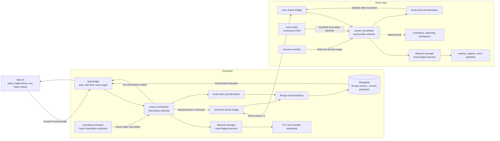
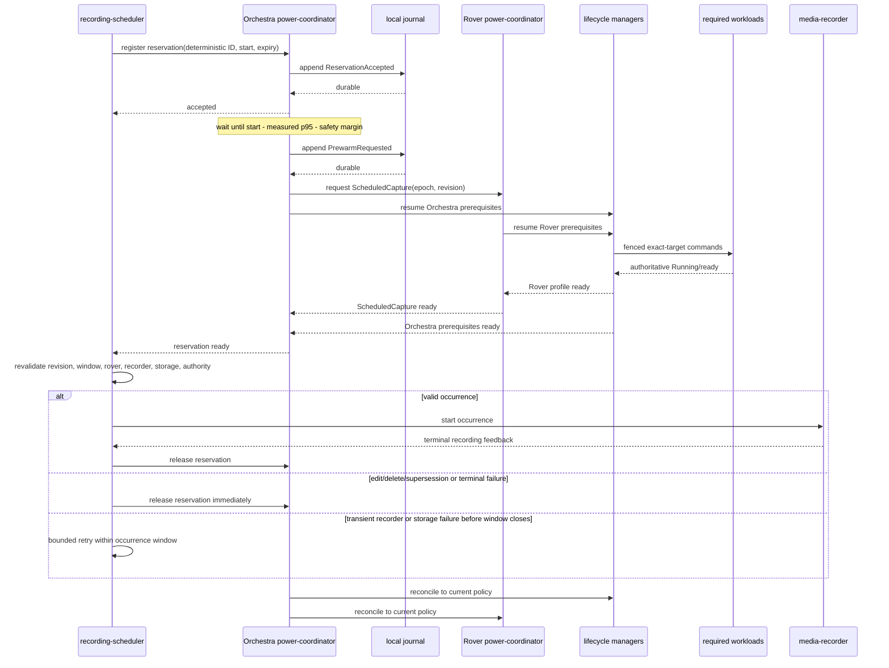

# Power Coordinator Architecture

Status: partial implementation baseline; reacceptance in progress (2026-07-26)
Decision source:
[brainstorm report](../plans/reports/brainstorm-260723-1442-rover-power-coordinator-sleep-wake.md)

## Purpose and Scope

This document is the target architecture. Commits through `a1cbc38` implement
parts of Phases 01–03, but the revalidated plan has not accepted those phases.
The plan cutoff audit is authoritative for current gaps.
Revalidated Phase 01 remediation is the active boundary; Phases 02–03 remain
blocked carryover, and Phase 04 is pending until Phases 01–03 are reaccepted.

Coordinate workload-level sleep/wake across Orchestra and Rover-Kiwi while
keeping safety, networking, lifecycle authority, scheduling, and observability
available.

V1 includes:

- `Awake`, `Auto`, and `Sleep` policy;
- minimal dependency-aware workload profiles;
- UI, scheduler, voice, media, and safety demands;
- Rover-local continuous keyword spotting;
- offline Rover wake plus snapshot-first Orchestra reconciliation on reconnect;
- local write-ahead event journal and MongoDB history/projection;
- CPU-confirmed automatic idle after a five-minute demand-free grace.

V1 excludes OS suspend, Wake-on-LAN, GPIO wake, process/container kill, local
general STT/NLU, and ML-based policy scoring.

## Ownership

| Component | Authority |
|---|---|
| recording scheduler | schedules, occurrences, deterministic reservation IDs |
| power coordinator | policy, demands, profiles, dependency barriers, aggregate state |
| lifecycle manager | exact-target fenced quiesce/resume execution |
| workload node | admission close, cancellation, device/model release, readiness |
| resource monitor | measured CPU/RSS freshness; never policy authority |
| web bridge | authenticated admission and live/history transport |
| MongoDB | durable history and materialized projection; never live safety authority |

`common/power-coordinator` runs on Orchestra and Rover. Orchestra is fleet
authority while connected. Rover may create bounded local KWS wake demand while
partitioned. Orchestra consumes Rover status before issuing a newer authority
epoch on reconnect. If the snapshot is unavailable or stale, Orchestra reports
`AuthorityUnknown`, retries observation, and issues no profile command or forced
takeover.

## Component Flow



Direct Rover mode uses the same Socket.IO contracts. Its local web bridge routes
directly to Rover power coordinator and omits both Zenoh bridge hops.

## Policy and Effective State

Policy is operator intent:

- `Awake`: hold normal workload profile active.
- `Auto`: compute minimum profile from active demands.
- `Sleep`: quiesce normal workloads; allow authenticated UI Wake and accepted
  scheduler reservation only.

Policy never changes merely because effective state changes. `Wake Rover`
changes `Sleep` to `Auto`; it does not hold `Awake`.

After the Auto idle gate succeeds, Rover Auto rests in `IdleListening`, not
`Dormant`, so Rover-local `Hey Kiwi` remains available. Rover explicit `Sleep`
enters `Dormant` and disables KWS. Orchestra Auto and explicit `Sleep` select
`OrchestraIdle`, which quiesces central speech recognition while leaving the
always-on control spine available.

```mermaid
stateDiagram-v2
    [*] --> Active: fresh restart / Awake
    Active --> AuthorityUnknown: Rover reconnect without fresh snapshot
    AuthorityUnknown --> Active: snapshot reconciled
    AuthorityUnknown --> AuthorityUnknown: retry observation; no profile command
    Active --> IdlePending: Auto + no demand
    IdlePending --> Active: new demand or CPU above threshold
    IdlePending --> Quiescing: five-minute grace + fresh low CPU
    Quiescing --> IdleListening: Auto
    Quiescing --> Dormant: explicit Sleep
    IdleListening --> Waking: UI, KWS, or schedule demand
    Dormant --> Prewarming: schedule reservation due
    Dormant --> Waking: authenticated UI Wake
    Prewarming --> Active: ScheduledCapture ready
    Waking --> Active: requested profile ready
    Active --> Quiescing: final bounded demand released
    Quiescing --> Degraded: target timeout/failure
    Waking --> Degraded: target timeout/failure
    Prewarming --> Degraded: readiness deadline missed
    Degraded --> Waking: bounded retry/reconcile
    Degraded --> Quiescing: policy requires low power
```



Fresh process/dataflow restart clears runtime policy and transient demands, then
boots normal workloads into `Awake`. Scheduler reconstructs future reservations
from its durable occurrence state.

## Profiles

| Profile | Required workloads |
|---|---|
| `Dormant` | control spine only |
| `IdleListening` | control spine, microphone capture, continuous KWS |
| `ScheduledCapture` | exact camera/audio/encoder/bridge/recorder dependencies |
| `NormalRover` | normal camera/audio/voice stack; ML remains lazy |
| `OrchestraIdle` | control spine without central speech recognition |
| `OrchestraSpeech` | central STT and command parser path |

Always-on control spine:

- both web/Zenoh bridges;
- both power/lifecycle coordinators;
- recording scheduler;
- resource monitors;
- rover/arm controllers;
- watchdog and emergency path.

Profiles use a static reviewed dependency graph. Sleep closes dependents before
prerequisites. Wake starts prerequisites and waits for authoritative readiness
before dependents.

### Protected recording work

The scheduler remains the durable source of recording-occurrence truth. Each
validated update is sent in an HMAC-SHA256 envelope using a per-Rover key over
`rover/{entity_id}/power/protected-work/{occurrence,snapshot,request}/v1`.
Orchestra signs occurrence and snapshot publications; the Rover bridge verifies
the signature, target, expiry, and payload before forwarding them to the local
coordinator. The Rover signs its snapshot requests, and Orchestra verifies
those requests before forwarding them to the scheduler. A Rover requests a
full snapshot at startup and every 15 seconds; the scheduler also republishes
snapshots after reconciliation.
The coordinator applies only monotonic occurrence updates and bounds retained
operations. `StartPending`, `Active`, and `StopPending` block Rover Auto
quiescing; a snapshot authoritatively clears stale protection. This relay
carries protected-work state only; it does not grant remote profile or policy
authority. Relay envelopes live for at most 120 seconds (snapshot requests use
a 30-second TTL), and verification tolerates up to 30 seconds of future clock
skew.

`POWER_PROTECTED_WORK_HMAC_KEY` is required by each Rover bridge and must be a
unique secret of at least 32 bytes. `POWER_PROTECTED_WORK_HMAC_KEYS` is required
by the Orchestra bridge and maps every active Rover ID to its matching secret.
For example, generate a Rover secret with `openssl rand -hex 32`, then set the
Orchestra map to `{"rover-kiwi":"that-same-secret"}`. Hosts must run normal
time synchronization (for example, chrony or NTP).

### Power transport authentication and isolation

Power commands, Rover authority snapshots, and remote journal acknowledgements
use the shared, versioned `SignedPowerEnvelope`. Its HMAC signature binds the
envelope kind, protocol version, sender role, target entity, issue/expiry
window, and payload. Journal acknowledgements additionally bind the deployment
identity and event ID. Orchestra verifies a Rover snapshot before forwarding
its raw payload to the coordinator or persisting its observed epoch; the Rover
verifies a remote acknowledgement before forwarding it for durable-event
compaction. Envelope kinds are not interchangeable.

Power control, status, snapshots, and journal events have bounded control-path
ingress. Status and snapshot observations coalesce to the latest value, while
pending journal records deduplicate by event ID. Audio/video and other
high-rate media use separate bounded, lossy ingress and publisher queues, so a
slow Zenoh media write cannot delay a power command, snapshot request, status,
acknowledgement, or journal record.

## Demand and Reservation Contract

### Power V1 wire contract

The implementation uses the versioned `power-v1` JSON contract in
`robo_rover_lib`. Every command, result, snapshot, transition, status, and
event carries `protocol_version: 1`, an explicit lifecycle `role`, and an
`entity_id`. Unknown fields are rejected. IDs are canonical UUIDs where the
contract calls for them; timestamps are millisecond windows with bounded TTLs
(`PowerCommand` at most 60 seconds, demands at most one hour, and reservations
at most seven days). Optional `detail` is bounded and sanitized.

The authority stamp is `{ epoch, sequence }`. Epoch changes fence an authority
generation; sequence orders messages within that generation. A command is
accepted only for the addressed role/entity and authority, and its result
returns the same `command_id` plus either `accepted: true` or a typed
`reason_code` (never both). Demand sources are constrained to compatible
profiles (for example, scheduler → `ScheduledCapture`, KWS → `NormalRover`),
and demand/reservation IDs are idempotent: reusing an ID with a different
immutable payload is rejected.

### Snapshot reconciliation gate

After a Rover reconnect, Orchestra enters `AuthorityUnknown` and may observe
status only. A matching, fresh, authenticated `PowerAuthoritySnapshot` must be
accepted before the gate grants the sole reconnect successor
`{ observed_epoch + 1, sequence: 1 }` for a profile command. Ordinary commands
carry the Rover's current authority and advance its sequence locally when
applied; they are not an external successor stream. Gaps, reordering, stale,
malformed, replayed, or out-of-order observations/commands are rejected, and
re-consuming the same authority is observe-only. This prevents a reconnect
from force-taking control or issuing a command from an unverified snapshot.

Conceptual contract:

```text
PowerDemand {
  protocol_version,
  demand_id,
  authority_epoch,
  source,
  entity_id,
  required_profile,
  priority,
  issued_at_ms,
  not_before_ms,
  expires_at_ms,
  renew_sequence
}
```

Duplicate ID with identical payload is idempotent. Duplicate ID with changed
payload is rejected. Demand capacity and TTL are bounded. Expired or final
demands never replay after restart.

Sources:

- authenticated UI interaction;
- recording scheduler reservation;
- local KWS;
- manual recording/media use;
- safety/maintenance.

Safety may veto a transition. KWS wake never carries or executes an actuator
command.

The concrete reservation form is a separate `PowerReservation` carrying a
`reservation_id`, `required_profile: ScheduledCapture`, target role/entity,
authority, and its validity window. Policy changes and demand/reservation
operations are transported as `PowerCommandAction` values (`SetPolicy`,
`RegisterDemand`, `ReleaseDemand`, `RegisterReservation`, or
`ReleaseReservation`).

## Transition identity and lifecycle fencing

Each aggregate profile change creates one UUID `transition_id` in a
`PowerTransition`; the ID is copied into status/events and into every
coordinator-originated `LifecycleCommand`. Lifecycle managers require that
ID for coordinator commands and bind asynchronous component status to the
same transition. The coordinator keeps an issued-request fence containing the
request ID, exact node, manager epoch, expected revision, and transition ID.
It accepts a `LifecycleCommandResult` only when the request is still issued,
`accepted` is true, the manager epoch matches, and the returned revision is
exactly `expected_revision + 1`. Unknown, rejected, duplicate, stale, or
future-revision results are ignored.

If a result arrives after its transition has been superseded, the accepted
result still advances that node's revision fence, clears the superseded stage's
issued flag, and causes an immediate command reissue for the current
transition using the newer revision. A timeout is not required for this
supersession path. Lifecycle status is itself monotonic per node: an
observation with an older `(manager_epoch, revision)` is discarded, so delayed
status cannot regress coordinator state. A transition is terminal only after
every required target reports its fenced terminal state; partial readiness is
not aggregate readiness.

When a pending transition is cancelled by a newer requested profile, the
requested profile and transition plan change immediately, but
`effective_profile` remains the last converged/applied profile until the
replacement transition reaches its terminal state. Cancellation therefore
does not falsely report the replacement as already applied; its transition
plan may use a safe `Dormant` origin while lifecycle commands reconcile from
the fenced node revisions.

Scheduled wake leases use `LifecycleWakeLease` with a monotonically increasing
per-lease `generation`. Acquire and release messages carrying an older or
revoked generation are rejected, so delayed network packets cannot revive a
released lease or fence a newer lease. Lease expiry is bounded and leases
temporarily affect effective state without mutating operator policy.

Released or expired reservations retain a bounded tombstone fence for the
reservation's maximum validity window. Replaying the identical immutable
reservation is idempotent; changing its payload or attempting to extend/revive
it is rejected until the tombstone expires. Tombstones count toward ledger
capacity and are pruned by time.

Lifecycle managers start a transition deadline when work first enters
`Resuming` or `Quiescing`. Reissued/superseding commands clear the prior
deadline, so each accepted revision receives a fresh bounded timeout; repeated
status ticks do not extend an in-flight deadline.

## Auto Algorithm

Auto enters low power only when:

```text
no active demand
AND no protected operation/session
AND required targets report idle/quiesce-capable
AND resource samples are fresh
AND each affected domain stays below configured CPU threshold
AND five-minute idle grace expires
```

CPU confirms semantic idleness; it never defines idleness alone. Memory is
outcome telemetry only. A new demand, protected operation, stale sample, or CPU
threshold breach cancels `IdlePending`.

Thresholds and consecutive-sample counts are benchmark-derived per domain.
One transition per domain may run at a time. Minimum awake hold and retry
backoff prevent churn.

## Scheduled Wake Sequence



Accepted is not ready. Scheduler starts only after aggregate ready and rechecks
the occurrence window/revision. Missed readiness gets a distinct terminal
reason.

## UI and Local Voice Wake

UI Wake:

1. any authenticated browser session submits an exact-Rover command;
2. coordinator journals intent;
3. policy changes from Sleep to Auto;
4. bounded two-minute UI demand activates `NormalRover`;
5. live activity renews the two-minute demand;
6. demand expiry returns to five-minute Auto evaluation.

Local voice:

1. KWS runs only in `IdleListening`;
2. exact phrase `Hey Kiwi` creates bounded local wake demand;
3. Rover activates `NormalRover`;
4. actuator state remains stopped;
5. after playback readiness, bundled PCM WakeAck says “I am on” once;
6. general command requires direct UI or Orchestra STT in v1.

KWS benchmark starts at one CPU thread. VAD gating remains a later optimization
only if continuous KWS misses idle CPU budget.

## Event Journal, Mongo Projection, and UI History

Every policy, demand, transition, phase, target, reconciliation, and terminal
change emits a versioned event.

Required order:

```text
append local transition intent
→ apply transition
→ emit live status
→ replicate event idempotently
→ advance Mongo current-state projection conditionally
```

Event identity includes entity, authority epoch, monotonic sequence, event ID,
transition ID, type, policy/profile, demand/source, exact target/revision,
timestamps, bounded reason, and sanitized detail.

MongoDB:

- `power_lifecycle_events`: append-only, unique event identity, 90-day TTL;
- `power_current_state`: one non-TTL projection per entity;
- indexes for entity/time, transition, demand, type, and reason.

TTL cleanup is asynchronous. Queries still enforce retention bounds.
Projection updates require newer epoch/sequence; reordered replication cannot
regress current state.

Live coordinator status is authoritative in the UI. Mongo history provides
timeline/filter/reconnect context. Cold projection is marked historical/stale
until live status arrives.

Local journal is bounded. Capacity policy must never discard an unapplied
safety intent silently. Prolonged outage surfaces degraded observability and
backpressure status.

### Phase 03 partial baseline

The coordinator persists durable command intent and applied records in the
journal under `POWER_JOURNAL_DIR` (default
`/var/lib/robo-fleet/power-journal/{role}`) using two files:
`power-events.log` and atomically replaced `power-journal.meta`. Records are
framed as version-1 JSON payloads with a CRC32 checksum. Startup recovery
truncates only a torn final frame; corruption before the final frame fails
closed. Metadata tracks the next journal sequence, highest authority epoch,
and projector acknowledgements. Acknowledged records are compacted only after
the projector confirms persistence. Capacity limits are configurable with
`POWER_JOURNAL_MAX_BYTES`, `POWER_JOURNAL_MAX_RECORDS`,
`POWER_JOURNAL_WAKE_RESERVE_BYTES`, and `POWER_JOURNAL_WAKE_RESERVE_RECORDS`.
Wake-causing command intents are classified into the reserved slice, while
non-wake traffic remains subject to ordinary capacity limits. Physical
disk-pressure is surfaced through journal health rather than silently dropping
an unapplied safety intent.

On Orchestra, `power-event-projector` consumes the coordinator's
`power_journal_record` Dora input and emits `power_event_ack` only after the
Mongo write succeeds. It requires `MONGODB_URI` and `MONGODB_DATABASE`, with
optional `POWER_DEPLOYMENT_ID` (default `default`). The projector initializes
indexes at startup, upserts events by `(deployment_id, entity_id, event_id)`,
and conditionally advances `power_current_state` by authority epoch then
sequence. Duplicate delivery is therefore idempotent, and reordered or stale
records cannot regress the current projection. History queries are bounded to
the 90-day retention window and support a time/event cursor.

Command intent/applied events now carry bounded action, policy, demand,
reservation, and lifecycle-target context. History queries support event type,
demand source, transition, target-node, reason-code, and time-cursor filters.
Projector startup and per-record writes use bounded linear-backoff retries;
failed attempts publish degraded health and do not acknowledge the journal
record until Mongo persistence succeeds. Rover record/ack transport remains
Phase 04 work, and the Mongo-backed test remains opt-in when its URI is unset.

## Authenticated browser power API (Phase 07)

The web bridge exposes power controls as Socket.IO events on the authenticated
session. The browser sends a versioned, canonical-UUID request; it does not
choose the target rover or actor. The bridge derives the target from the
server-side selected active rover, checks the session and the dedicated power
command rate limiter, and rejects invalid, stale, duplicate, cross-entity, or
over-capacity requests before queueing them.

| Event | Request | Result/updates |
|---|---|---|
| `power_policy` | `{ protocol_version, request_id, policy }` | `power_command_result` with the coordinator command result and matching `request_id` |
| `power_wake` | `{ protocol_version, request_id }` | `power_wake_result`; accepted wake changes `Sleep` to `Auto` and owns a bounded two-minute UI demand |
| `power_history` | `{ protocol_version, request_id, cursor?, limit?, from_ms?, to_ms?, event_type?, reason_code? }` | `power_history_result`; the bridge also emits the current live `power_status` when available |
| coordinator updates | — | authenticated `power_status` and validated `power_transition` broadcasts |

Wake ownership is released on expiry, disconnect, selected-target change, or
server cleanup. Admission or command acceptance is not readiness: the UI must
wait for a live status/transition before showing an effective profile as
applied. An expired session receives `auth_error` and is disconnected.

History is a bounded, read-only view. `power_lifecycle_events` and
`power_current_state` are queried for the selected entity within the 90-day
window (default 50, maximum 100 events) with a time/event cursor. The returned
`historical_status` is explicitly cold projection data. A live coordinator
`power_status` and its `(epoch, sequence)` always outrank historical data;
historical or delayed Mongo results must never overwrite newer live state.

## Signed transition relay and direct mode

Rover transitions are not trusted merely because they arrived over Zenoh. The
Rover Zenoh bridge validates the `PowerTransition`, wraps it in a
`SignedPowerEnvelope` of kind `Transition`, and signs it with the configured
per-Rover command key. The Orchestra bridge accepts only a fresh envelope whose
kind, protocol version, sender role (`Rover`), target entity, and HMAC validate;
it then forwards the raw validated transition to the web bridge. The web bridge
performs schema validation and emits it only to authenticated sockets. Envelope
kinds are not interchangeable with commands, snapshots, or acknowledgements.

In `ROVER_MODE=direct`, the local web bridge routes the same Socket.IO contract
straight to the Rover power coordinator. Zenoh and the Orchestra bridge are
omitted, but session authentication, server-side target pinning, rate limits,
bounded queues, live-over-history ordering, and transition validation remain
required. Direct mode is therefore a local/dev routing choice, not a way to
bypass the browser API security boundary.

### Phase 07 verification boundary

The repository contains backend contract and queue tests, but a complete Phase
07 acceptance requires the external browser/Tauri UI, reconnect and disconnect
flows, distributed Zenoh signature rejection, and target-hardware timing. Those
browser, distributed, and hardware gates are not established by the backend
unit tests alone; do not treat a `power_command_result` or a Mongo history
response as proof that the rover is ready or awake.

## Invariants

- Policy, requested profile, and effective profile are distinct.
- Auto's demand-free resting profile is `IdleListening`; only explicit Sleep
  enters `Dormant`.
- Scheduler owns schedule truth; coordinator owns power truth.
- Lifecycle manager executes exact target transitions; it does not choose
  global policy.
- Admission acknowledgment is never rendered as applied state.
- Dormant/ready requires every required target terminal acknowledgment.
- Voice wake never executes motion, arm, recording, or tracking commands.
- No pre-sleep actuator/media command replays after wake.
- Stale epoch/revision cannot regress local or Mongo current state.
- Orchestra never force-takes authority or issues a profile command until it
  consumes a fresh Rover snapshot.
- MongoDB/network outage cannot block local safety or wake.
- Fresh restart starts Awake and discards transient demands.
- Resource staleness blocks automatic sleep.
- Event detail never stores wake audio, secrets, filesystem paths, or
  unbounded native errors.

## Acceptance Targets

- prerecorded wake acknowledgment under 1.5 s p95;
- `NormalRover` ready under 5 s p95;
- schedule prewarm from measured p95 plus safety margin;
- Auto idle grace five minutes;
- CPU reduction measured against active profile on target hardware;
- deterministic device/model/worker release;
- RSS is evidence, not a hard success gate;
- continuous KWS false accept/reject and noisy-environment benchmark;
- offline local wake and snapshot-first Orchestra reconciliation;
- no stale replay under restart, reordering, or partition injection;
- every applied transition has a preceding local journal intent;
- 90-day history query and projection cannot regress from old replication.

## Deferred Decisions

- exact checksum-pinned KWS model and false-accept/false-reject limits for
  `Hey Kiwi`;
- benchmark-derived per-domain CPU thresholds and consecutive sample count;
- minimum awake hold;
- local journal capacity and full-outage policy;
- Rover snapshot retry/staleness thresholds;
- Grafana export and aggregates beyond raw 90-day events;
- GPIO wake, local bounded STT/NLU, and OS suspend.
